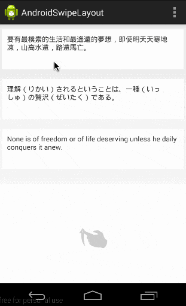

## Android自定义View整理

自定义View的绘制机制，讲的最好的就是《Android开发艺术探究》这本书。
推荐一篇博文`[公共技术点之 View 绘制流程](http://a.codekk.com/detail/Android/lightSky/公共技术点之%20View%20绘制流程)。
还有一些系列博客，参考：
#### [自定义View系列](https://github.com/GcsSloop)
* [安卓自定义View基础 - 坐标系](https://github.com/GcsSloop/AndroidNote/blob/master/CustomView/Base/%5B01%5DCoordinateSystem.md)
* [安卓自定义View基础 - 角度弧度](https://github.com/GcsSloop/AndroidNote/blob/master/CustomView/Base/%5B02%5DAngleAndRadian.md)
* [安卓自定义View基础 - 颜色](https://github.com/GcsSloop/AndroidNote/blob/master/CustomView/Base/%5B03%5DColor.md)
* [安卓自定义View进阶 - 分类和流程](https://github.com/GcsSloop/AndroidNote/blob/master/CustomView/Advance/%5B01%5DCustomViewProcess.md)
* [安卓自定义View进阶 - 绘制基本图形](https://github.com/GcsSloop/AndroidNote/blob/master/CustomView/Advance/%5B02%5DCanvas_BasicGraphics.md)
* [安卓自定义View进阶 - 画布操作](https://github.com/GcsSloop/AndroidNote/blob/master/CustomView/Advance/%5B03%5DCanvas_Convert.md)
* [安卓自定义View进阶 - 图片文字](https://github.com/GcsSloop/AndroidNote/blob/master/CustomView/Advance/%5B04%5DCanvas_PictureText.md)
* [安卓自定义View进阶 - Path基本操作](https://github.com/GcsSloop/AndroidNote/blob/master/CustomView/Advance/%5B05%5DPath_Basic.md)
* [安卓自定义View进阶 - 贝塞尔曲线](https://github.com/GcsSloop/AndroidNote/blob/master/CustomView/Advance/%5B06%5DPath_Bezier.md)
* [安卓自定义View进阶 - Path完结篇(伪)](https://github.com/GcsSloop/AndroidNote/blob/master/CustomView/Advance/%5B07%5DPath_Over.md)
* [安卓自定义View进阶 - Path玩出花样(PathMeasure)](https://github.com/GcsSloop/AndroidNote/blob/master/CustomView/Advance/%5B08%5DPath_Play.md)
* [安卓自定义View进阶 - Matrix原理](https://github.com/GcsSloop/AndroidNote/blob/master/CustomView/Advance/%5B09%5DMatrix_Basic.md)
* [安卓自定义View进阶 - Matrix详解](https://github.com/GcsSloop/AndroidNote/blob/master/CustomView/Advance/%5B10%5DMatrix_Method.md)
* [安卓自定义View进阶 - Matrix Camera](https://github.com/GcsSloop/AndroidNote/blob/master/CustomView/Advance/%5B11%5DMatrix_3D_Camera.md)
* [安卓自定义View进阶 - 事件分发机制原理](https://github.com/GcsSloop/AndroidNote/blob/master/CustomView/Advance/%5B12%5DDispatch-TouchEvent-Theory.md)

#### [自定义View其实很简单](http://blog.csdn.net/column/details/androidcustomview.html)
*  [自定义控件其实很简单1/12](http://blog.csdn.net/column/details/androidcustomview.html)
*  [自定义控件其实很简单1/6](http://blog.csdn.net/column/details/androidcustomview.html)
*  [自定义控件其实很简单1/4](http://blog.csdn.net/column/details/androidcustomview.html)
*  [自定义控件其实很简单1/3](http://blog.csdn.net/column/details/androidcustomview.html)
*  [自定义控件其实很简单5/12](http://blog.csdn.net/column/details/androidcustomview.html)
*  [自定义控件其实很简单1/2](http://blog.csdn.net/column/details/androidcustomview.html)
*  [自定义控件其实很简单7/12](http://blog.csdn.net/column/details/androidcustomview.html)
*  [自定义控件其实很简单2/3](http://blog.csdn.net/column/details/androidcustomview.html)
*  [自定义控件其实很简单3/4](http://blog.csdn.net/column/details/androidcustomview.html)

事件传递机制讲的最好的，最易懂的就是《Android群英传》，也推荐一篇博客
[公共技术点之 View 事件传递](http://a.codekk.com/detail/Android/Trinea/公共技术点之%20View%20事件传递)

## 值的学习的几个自定义View开源项目

1. [NumberProgressBar](https://github.com/daimajia/NumberProgressBar)
这个项目可以熟练掌握如何控制view在界面中的位子

2. [AndroidSwipeLayout](https://github.com/daimajia/AndroidSwipeLayout)综合

Dialog，推荐两个我认为比较好的：

1. [DialogPuls](https://github.com/orhanobut/dialogplus)
2. [Android-AlertView](https://github.com/saiwu-bigkoo/Android-AlertView)

Toast的展示效果可以参考[这个](https://github.com/LuckSiege/CustomView)，是仿IOS的。

类似于微信、微博的底部菜单样式：参考[wechat](https://github.com/motianhuo/wechat)，
此例子中还包括二维码扫描、统一异常处理、SplashActivity的写法。

列表的下拉刷新、上拉加载更多，参考[LRecyclerView](https://github.com/jdsjlzx/LRecyclerView)，
此例子基于RecyclerView实现的，鉴于ListView将来会被RecyclerView替代，因此以后列表的实现最好都用它。

参考[awesome-view](https://github.com/xinghongfei/awesome-view)

下拉刷新参考[HaoRefresh](https://github.com/fangx/HaoRefresh)

一个[仿今日头条](https://github.com/yewei02538/TodayNews)的开源项目，就是基于MVP+RxJava+Retrofit的，
里面有很多值得借鉴的地方，不一一详述。

基本上能想到的展示效果，Github上都有开源的，自己去找就行了。

剩下的在做项目的过程中会慢慢丰富。

